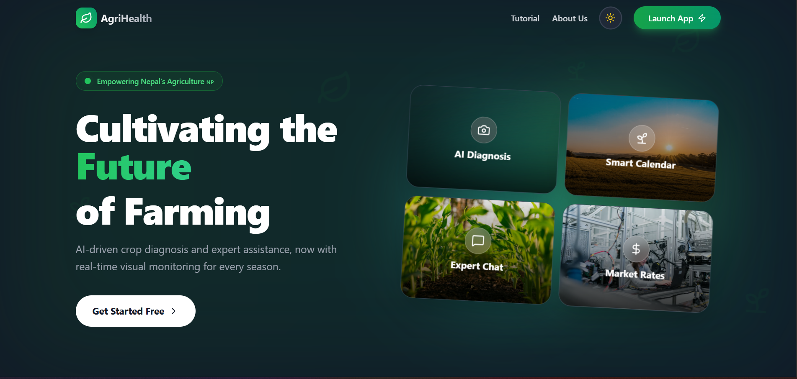
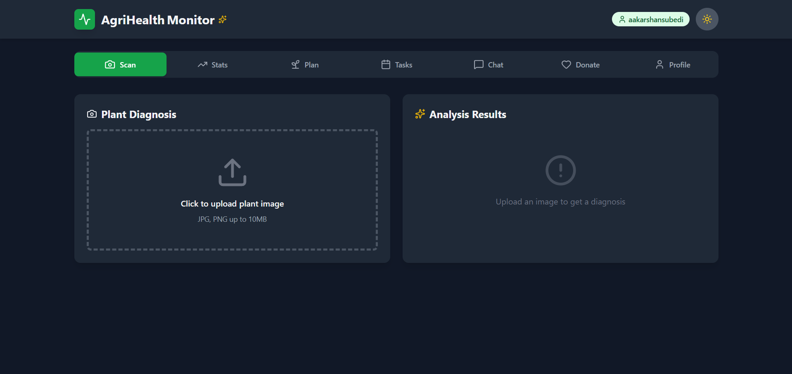

# 🌱 AgriHealth Monitor (कृषि स्वास्थ्य)

<div align="center">

  

  <br />

  
  
  
  

  <h3>Empowering Nepal's farmers with AI-driven diagnostics, smart planning, and voice assistance.</h3>

  [**View Demo**](https://agrihealth-monitor.vercel.app/) • [**Report Bug**](https://github.com/SABINXD/nmssitfest_codexagrivision/issues)

</div>

---

## 📱 App Previews

We believe in a **Mobile-First** approach for farmers. Here is how AgriHealth looks in action:

| **Landing & Onboarding** | **AI Diagnosis (Dr. Crop)** |
|:-------------------------:|:---------------------------:|
|  |  |
| *Modern, accessible entry point.* | *Instant disease detection with 95% accuracy.* |

| **Smart Dashboard** | **Voice Assistant & Planner** |
|:-------------------:|:-----------------------------:|
|  |  |
| *Live weather & Kalimati market rates.* | *Speak in Nepali & plan the season.* |

---

## 🏗️ System Workflow

How the data flows from the Farmer's phone to our AI Engine and Database.

```mermaid
graph TD
    User([👤 Farmer]) --> |Opens App| Landing[🌐 App Interface]
    
    subgraph "Frontend Layer"
        Landing --> |Log In| Auth[🔥 Firebase Auth]
        Auth --> |Authenticated| Dashboard[📱 Dashboard]
    end

    subgraph "AI Core (Google Gemini)"
        Dashboard --> |Upload Image| Vision[👁️ Gemini Vision]
        Dashboard --> |Voice Input| Chat[🧠 Gemini Flash]
        Chat --> |Text Response| TTS[🔊 Gemini TTS]
    end

    subgraph "Data Layer"
        Vision --> |Save Result| DB[(☁️ Firestore)]
        Chat --> |Save Plan| DB
    end
    
    DB --> |Sync Tasks| Dashboard